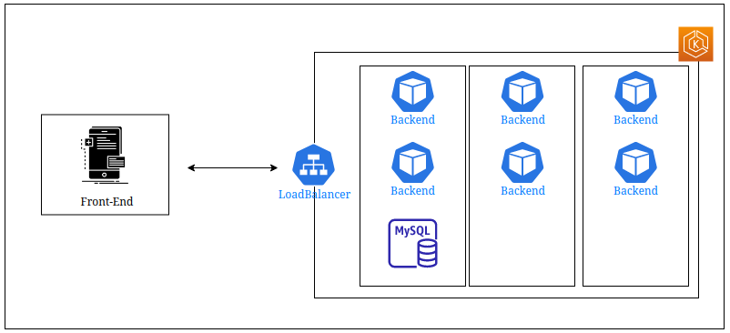

# Backend EKS Kubernetes Cluster - DIO K8S Challenge 1

This repo contains code for the first challenge of the Digital Innovation One Kubernetes' section.

The goal was to create a Kubernetes cluster for a backend application. To do so, it was used AWS EKS service to manage our containers. The image bellow shows the architecture:

  

